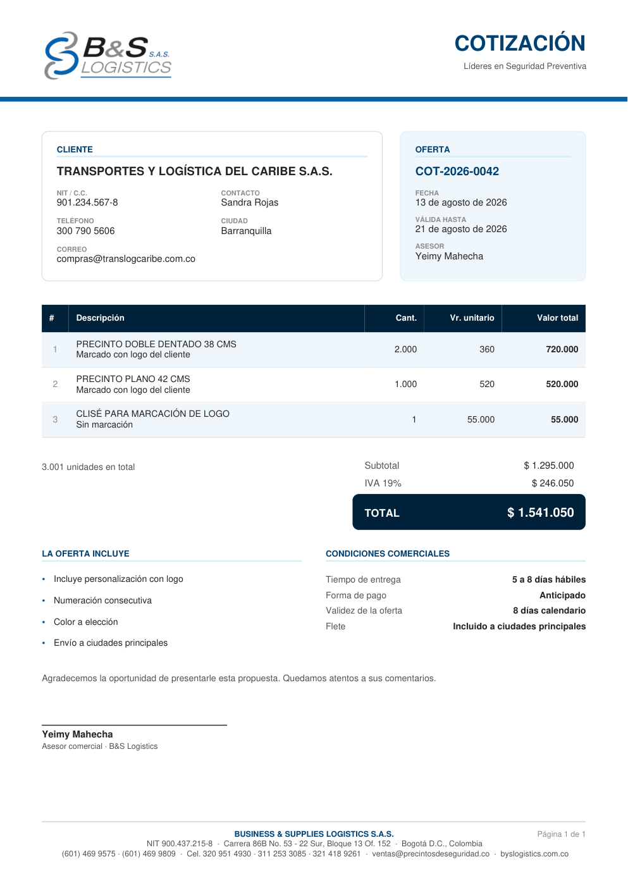

# Cotizador · B&S Logistics

Arma una cotización desde el listado de precios y produce dos cosas: el **PDF
formal** con la marca de la empresa y el **mensaje de WhatsApp** que hoy se
copia y pega a mano desde el Excel.

Funciona entero en el navegador. No hay servidor, no hay base de datos y no
hace falta conexión una vez cargada la página.




---

## Por qué existe

El área comercial cotiza desde `LISTADO_PRECIOS_2026.xlsx`. Ese archivo tiene
570 filas de precios en escalones por cantidad, más tres hojas de plantillas
donde alguien reescribe a mano el mismo mensaje cada vez. De ahí salen los
tres errores que este cotizador elimina:

1. **Buscar el escalón a ojo.** El precio depende de la cantidad y de si el
   producto lleva logo, y los escalones no son iguales para todos los
   productos (hay 38 juegos distintos). Aquí se resuelve solo.
2. **Recalcular el IVA a mano.** Tres filas del Excel tienen el total
   descuadrado respecto a `unitario × cantidad`.
3. **Reescribir las condiciones.** Entrega, vigencia y forma de pago cambian
   según sea producto personalizado o de stock; ahora son dos plantillas.

---

## Puesta en marcha

```bash
npm install
npm run dev      # http://localhost:5173
```

Para producción:

```bash
npm run build    # deja el sitio estático en dist/
npm run preview
```

`dist/` usa rutas relativas: se puede subir a cualquier hosting, colgar de un
subdirectorio de byslogistics.com.co o abrir directamente desde el disco.

---

## Actualizar los precios

Los precios **no se editan en el código**. La fuente sigue siendo el Excel que
mantiene el área comercial:

```bash
# 1. Deje el listado nuevo en datos-origen/
cp ~/Descargas/LISTADO_PRECIOS_2027.xlsx datos-origen/

# 2. Regenere el catálogo
npm run catalogo -- datos-origen/LISTADO_PRECIOS_2027.xlsx

# 3. Revise lo que el script reporta y vuelva a construir
npm run build
```

El script (`scripts/extraer_catalogo.py`, sólo necesita `openpyxl`) imprime al
final cuántas incidencias encontró. **Léalas**: son las filas que el Excel trae
raras y que alguien debería mirar. En el listado de 2026 son seis, y las mismas
aparecen dentro de la aplicación, al pie de la pantalla.

Si el catálogo va a salir de la máquina del área comercial, use
`npm run catalogo -- <archivo> --sin-costos` para omitir el costo de compra y
el nombre del proveedor.

### Qué hace el extractor con el Excel

El Excel es un documento de trabajo, no una base de datos. El script normaliza:

| Rareza del listado | Qué hace el script |
|---|---|
| La referencia sólo aparece en la primera fila del bloque | La arrastra hacia abajo |
| La columna LOGO también sólo aparece una vez por sub-bloque | La arrastra; sin esto las tandas con y sin logo se mezclan |
| `CLISE PARA LOGO` metido como si fuera un escalón de cantidad | Lo saca a producto propio |
| Erratas (`GAYA`, `DELLO`, `REFE`, 40 espacios seguidos) | Las corrige al leer, sin tocar el original |
| Totales que no cuadran con `unitario × cantidad` | Manda el unitario, y lo reporta |
| El mismo escalón dos veces con precios distintos | Se queda con el menor, y lo reporta |
| Precio que sube al subir de escalón | Lo respeta, y lo reporta |
| `CAJA X 25 UNIDADES` en la columna de cantidad del proveedor | Lo guarda como empaque |
| Notas sueltas leídas como si fueran productos | Las descarta |

El logo del PDF se empotra aparte, con `npm run logo`, para que el documento se
genere sin pedir nada por red.

---

## Cómo está organizado

```
scripts/          Excel → catálogo JSON, y logo → módulo TypeScript
src/
  datos/          catálogo generado, datos de la empresa, plantillas de condiciones
  dominio/        precios, totales, modelo de la cotización — funciones puras
  pdf/            tokens de marca, primitivas de dibujo, armado del documento
  mensajes/       mensaje de WhatsApp
  ui/             pantalla React
```

La regla que ordena todo: **`dominio/` no sabe que existe React ni jsPDF**. Se
puede probar sin navegador, y de hecho así se prueba.

```bash
npm test                    # 34 pruebas
MUESTRA_PDF=1 npm test      # además deja PDFs de ejemplo en muestras/
```

Entre las pruebas hay dos que reproducen cotizaciones reales del Excel —la de
la hoja `COTIZACION FORMAL` y la de `COTIZACION YEIMY`— y comprueban que el
cotizador saca los mismos totales al peso.

---

## Decisiones que conviene conocer

**El precio se sugiere, no se impone.** El listado propone el precio del
escalón; el asesor puede escribir otro y la línea avisa de la diferencia, con
un botón para volver al sugerido. La lista de precios orienta una negociación,
no la reemplaza.

**Cantidades intermedias.** Pedir 1.500 unidades cuando los escalones son 1.000
y 2.000 se cobra al precio de 1.000: manda el escalón más alto que la cantidad
alcanza. Por debajo del mínimo publicado se propone el escalón más bajo, pero
la línea queda marcada en ámbar.

**Oportunidad de volumen.** Cuando llevar más unidades sale más barato *en
total*, la línea lo dice con la cifra exacta. Es el argumento que hoy el
comercial hace de cabeza.

**El margen no sale nunca en el PDF.** El catálogo guarda el costo de compra
del Excel y la pantalla puede mostrar el margen por línea (casilla «Ver
margen»), pero ni el PDF ni el mensaje de WhatsApp lo mencionan.

**El consecutivo es local.** `COT-2026-0001` se guarda en el navegador del
asesor y se gasta al emitir el documento, no al abrir la pantalla. Sirve para
que dos cotizaciones del mismo día no salgan iguales; no es un registro
contable. Con varios asesores, el número tendrá que venir de un sistema
central.

**El borrador se guarda solo.** Cerrar la pestaña no cuesta el trabajo hecho.

---

## Datos de la empresa

Están en `src/datos/empresa.ts`, cruzando dos fuentes: el sitio
byslogistics-web (teléfonos y correo comercial vigentes) y las hojas de
cotización del Excel (NIT y dirección, que no están en el sitio).

Dos cosas pendientes de confirmar con la empresa:

- **Razón social.** El logo y el sitio dicen `S.A.S.`; las cotizaciones viejas
  del Excel dicen `LTDA.`. Se usa `S.A.S.`.
- **Tarifa del clisé.** El listado tiene dos: `$55.000` fijo por diseño
  (fila 40) y `$2.300` por unidad (hoja `COTIZADOR`). Se cargó la de `$55.000`
  como servicio independiente.

---

## Lo que este cotizador todavía no hace

- **Rastreo satelital.** Los equipos JT701D y JT709T se cotizan por número de
  equipos, con planes de plataforma y tarifas de alquiler: es otro modelo de
  precio. Los datos ya se extraen a `catalogo.json` (`satelitales`), pero la
  pantalla aún no los ofrece.
- **Recargo por centímetro adicional.** Las etiquetas cobran un extra por
  centímetro sobre la medida base, distinto para cada medida. El dato se
  extrae y se muestra junto a la medida, pero no se suma solo: hay que
  escribir el precio a mano, que es como se hace hoy.
- **Descuento de distribuidor.** El Excel menciona un 10 % en dos celdas
  sueltas. Se puede aplicar como descuento de línea, pero no está automatizado
  porque no está claro si es política general.
